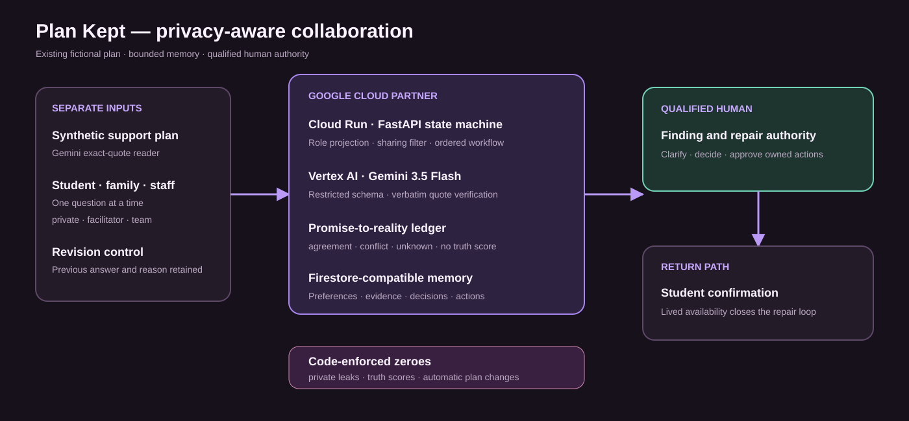

# Plan Kept

> The plan promised it. Was it there in practice?

Plan Kept is a privacy-aware collaborative partner for a qualified school team. It reads an
existing support plan, opens separate student/family/staff perspectives with participant-controlled
sharing, surfaces agreement or conflict without deciding who is truthful, and tracks human-approved
repair back to the student’s lived experience.

**Hackathon track:** The Collaborative Partner  
**Google model:** Gemini 3.5 Flash through Vertex AI / Google Gen AI SDK  
**Google Cloud:** Cloud Run package plus Firestore-compatible bounded memory  
**Data:** The school, student, family, plan, responses, records, staff, and actions are fictional.

## The narrow contribution

Incident reporting, debrief, notification, and behavior-analysis products already exist. Plan Kept
starts from a different object—an **existing approved support promise**—and asks whether it was
understood, available, offered, usable, and experienced.

It is not an incident report, therapy system, diagnosis tool, risk predictor, credibility scorer,
legal-compliance engine, discipline/restraint recommender, or automatic plan generator.

## Demonstrated collaboration

```text
four exact-quoted promises in a synthetic plan
  -> four separate, preference-aware sessions
  -> participant-controlled private / facilitator / team sharing
  -> structured promise-to-reality ledger
  -> conflict becomes a targeted clarification, never a truth score
  -> named facilitator decides the finding and approves repair
  -> three owned, dated repair actions
  -> student confirms whether support appeared in practice
```

Private responses are omitted from facilitator views and synthesis by code, not merely hidden with
CSS. Revisions preserve history. The final loop closes only on student-experience confirmation.

## Research and prior art

- [U.S. Department of Education restraint and seclusion resource](https://www.ed.gov/teaching-and-administration/safe-learning-environments/school-safety-and-security/school-climate-and-student-discipline/restraint-and-seclusion-resource-document): safety boundary and prevention framing.
- [Center on PBIS restraint/seclusion resources](https://www.pbis.org/topics/restraintseclusion): prevention-oriented debrief and environmental adjustment.
- [Five-year collaborative problem-solving study](https://pubmed.ncbi.nlm.nih.gov/19033167/): mechanism inspiration from a child psychiatric setting, not ordinary K–12 validation.
- [Trauma-informed intervention systematic review](https://pubmed.ncbi.nlm.nih.gov/37593061/): design principles and limits of available evidence.
- [RecordHQ](https://recordhq.co.uk/), [Cairn](https://cairn.school/), and [MangoApps’ incident/debrief template](https://www.mangoapps.com/templates/forms/seclusion-and-restraint-incident-reporting-and-debrief-form): prior-art boundary.

These sources support the problem and collaboration principles. They do not validate Plan Kept,
prove prevention, establish legal compliance, or justify applying clinical results to schools.

## Architecture



| Layer | Running implementation |
|---|---|
| Interface | Responsive role-aware workspace and judge brief with light/dark themes |
| API | FastAPI bounded state machine with role-filtered views |
| Partner | Questions, sharing, revision, synthesis, clarification, repair, follow-up |
| Model | Gemini 3.5 Flash quote-grounded plan reader; deterministic replay for tests |
| Memory | Structured preferences, plan promises, decisions, actions, and revision history |
| Persistence | In-memory local adapter; Firestore adapter for Cloud mode |
| Authority | Qualified facilitator decides findings/repairs; student experience closes the loop |

## Run and verify

```powershell
cd app
python -m pip install -r requirements.txt
$env:PYTEST_DISABLE_PLUGIN_AUTOLOAD="1"
python -m pytest -q
python scripts/check_a11y.py
python -m uvicorn service.main:app --host 127.0.0.1 --port 8000
python scripts/demo_flow.py --url http://127.0.0.1:8000
```

Open `/`, `/judges`, `/api/proof`, `/api/hardening/proof`, `/api/research`, `/api/conformance`, and `/docs`.

Current local baseline on August 16, 2026:

- `91 passed`
- `10/10` static accessibility checks
- HTTP acceptance and deployed proof are refreshed in [VALIDATION_EVIDENCE.md](VALIDATION_EVIDENCE.md)

The external `PYTEST_DISABLE_PLUGIN_AUTOLOAD` setting isolates this repository from an incompatible
globally installed pytest async plugin; application tests themselves are green.

## Gemini replay and recording

The committed response was produced by a live Vertex AI Gemini 3.5 Flash call on the fictional plan.
It retained `4/4` support promises and every retained quote was verified against the transcription.
The public demo replays that measured fixture deterministically; it does not imply broader accuracy.

```powershell
$env:GOOGLE_CLOUD_PROJECT="your-project"
python scripts/record_plan.py --image web/plan-fixture.png
```

## Deploy

```bash
cd app
export GOOGLE_CLOUD_PROJECT="your-project"
./deploy.sh
```

A release still requires the public URL to pass the executable demo and clean-browser QA.

## Known limitations

- One fictional plan and conflict cannot establish general school usability.
- Local policies, consent, access, retention, records law, and professional roles require review.
- No student, family, educator, school leader, disability advocate, privacy expert, or lawyer has
  validated the workflow.
- No prevention, educational, clinical, legal, equity, or time-saving outcome is claimed.

No school, agency, family, researcher, source publisher, or prior-art vendor endorses Plan Kept.

## August 16 hardening

Plan Kept now supports participant sharing changes and withdrawal, invalidates derived synthesis after consent changes, gates role views with demo tokens, visibly quarantines instruction-shaped input, schedules an exactly-once seven-day follow-up, and emits Cloud Trace correlation. Demo tokens are not production identity and are explicitly labelled as such.

## Findings and learnings

- Collaboration is not consensus generation: disagreement becomes a precise clarification rather than a credibility score.
- Privacy remains changeable after submission; withdrawal and sharing changes invalidate derived synthesis.
- Memory is safer as bounded preferences, promises, evidence, decisions and actions than raw transcript replay.
- This fictional scenario proves privacy and workflow behavior, not prevention, legal compliance or school usability.

## Originality and reused-code disclosure

Plan Kept's workflow, consent semantics, role views, UI, fixtures, evaluation, failure laboratory, research and submission materials were created for this contest-period submission. Generic clock, wake, observability, quarantine and verifier primitives were adapted from the entrant's Day Three contest-period production spine. They are disclosed in app/spine/__init__.py and independently tested here.

## Automated background execution

The deployed plan-kept-wake-scan Cloud Scheduler job calls the internal wake worker every minute with a Google-signed OIDC token from the dedicated agent-wake-scheduler service account. The application verifies audience, issuer, email and email verification before scanning. Unauthenticated calls return HTTP 401. The worker claims Firestore wakes transactionally, executes idempotent actions, bounds retries and retains dead letters. Reproduce or update the job with app/infra/provision_scheduler.ps1 after deployment.

